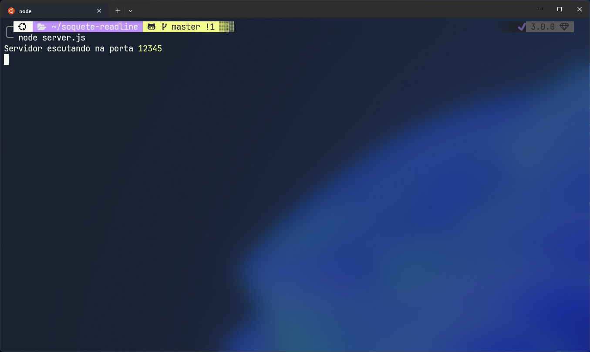
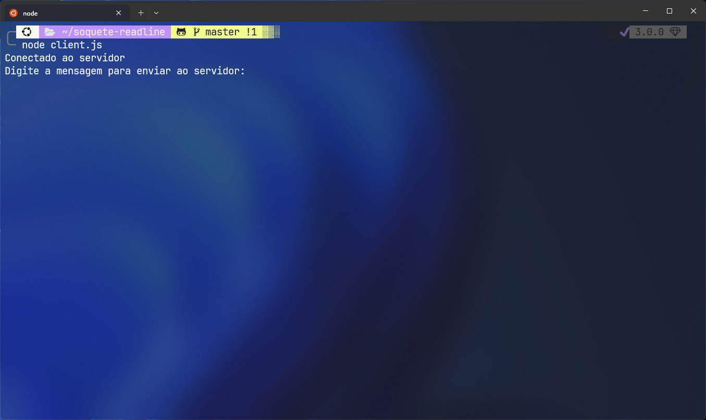
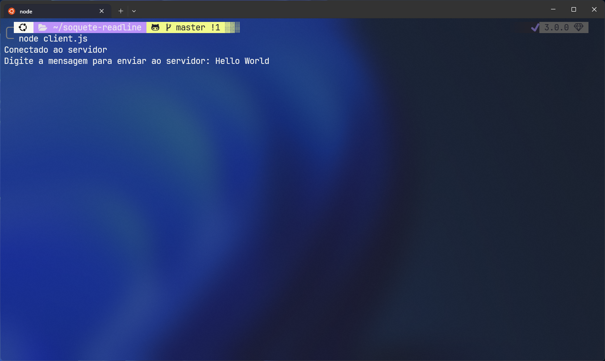

# Socket + Headline


Este guia fornece instruções passo a passo sobre como baixar e executar um projeto de comunicação entre cliente e servidor em JavaScript e Node.js.

## Pré-requisitos

Certifique-se de ter o Node.js instalado em seu computador. Você pode baixá-los e instalá-los a partir do site oficial do Node.js.

## Guia

1. **Clone o repositório:**

   Abra o terminal e execute o seguinte comando:

   ```bash
   git clone https://github.com/murilodestefani/soquete-readline.git
   ```

2. **Navegue até o diretório do projeto:**

   Use o comando `cd` para entrar no diretório do projeto que você acabou de clonar:

   ```bash
   cd soquete-readline
   ```

3. **Execute o Servidor:**

   Abra um terminal e execute o comando abaixo para deixar o `server` rodando em segundo plano:

   ```bash
   node server.js
   ```

   

4. **Execute o Client:**

   Abra um outro terminal e execute o comando abaixo para rodar o `client` que será o responsável por enviar mensagens ao `server`:

   ```bash
   node client.js
   ```

   

5. **Enviando Mensagem pelo Client:**

   No terminal do `client` digite uma mensagem e tecle enter assim como a imagem de exemplo abaixo:
   

6. **Resposta do Servidor**

   No terminal do `server` se a mensagem enviada pelo cliente for recebida com sucesso aparecerá o conteúdo da mensagem enviada pelo `client`:
   

7. **Enviando Mensagem pelo Server**

   No terminal do `server` também é possivel enviar mensagem ao `client`, digite a mensagem e tecle enter. Veja um exemplo abaixo do envio e da resposta pelo `client`.

   
   
